# Before Optimization
# Jmeter Test Plan 1
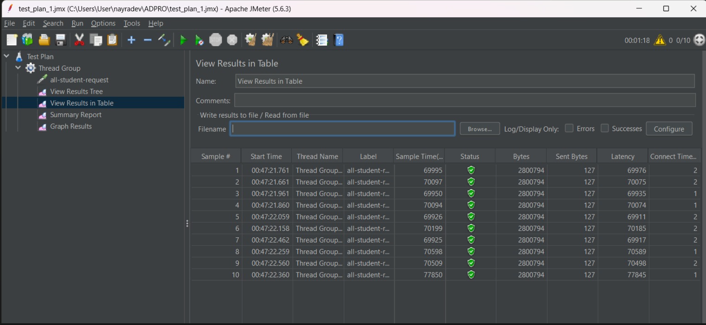

# Jmeter Test Plan 2
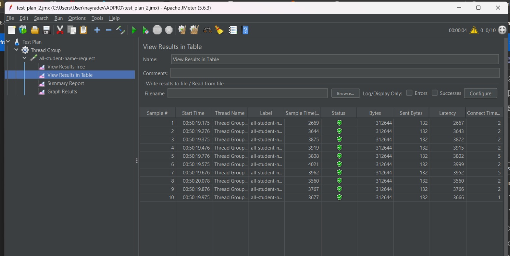

# Jmeter Test Plan 3
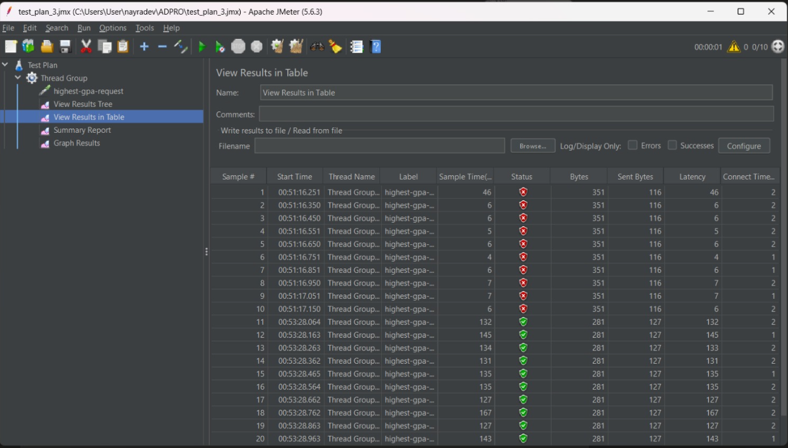

# Test Result 1
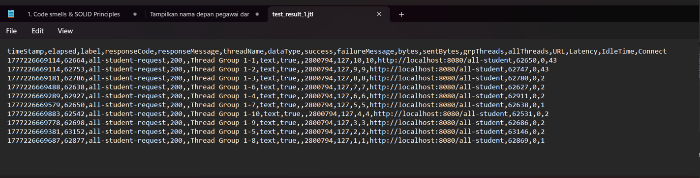

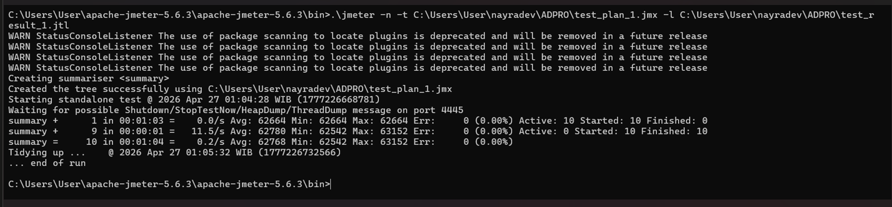

# Test Result 2
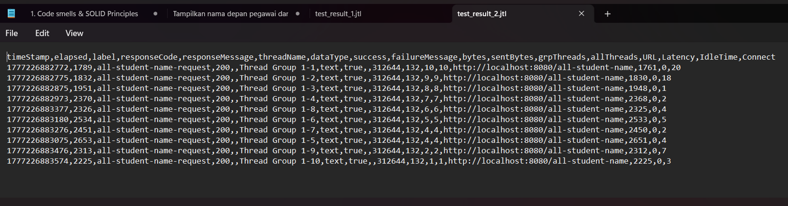

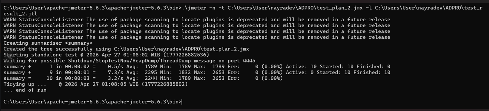

# Test Result 3
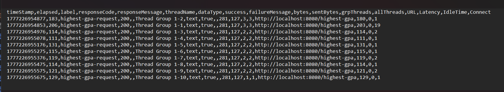

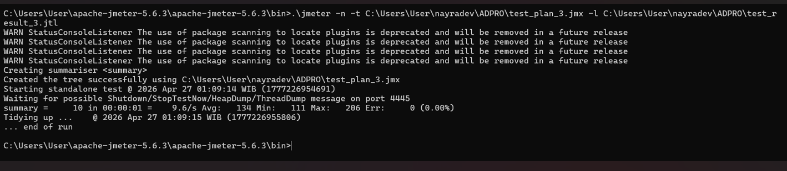

Endpoint :  /all-student
Average Sample Time : 62,768 ms

Endpoint : /all-student-name
Average Sample Time : 2,244 ms

Endpoint : /highest-gpa
Average Sample Time : 134 ms

# After Optimization
# Test Result 1
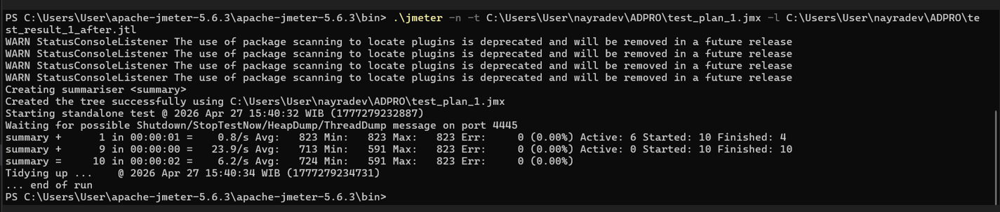
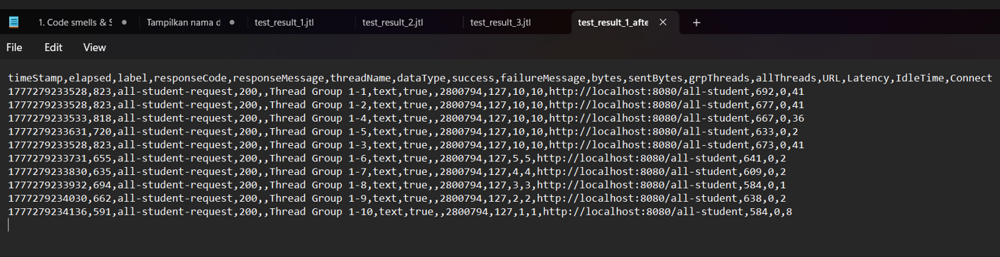

# Test Result 2
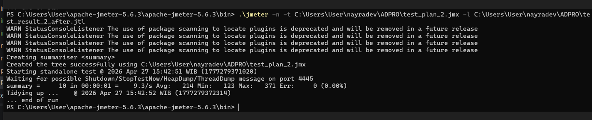
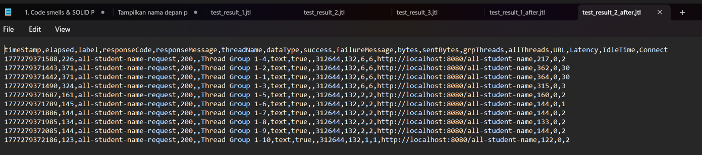

# Test Result 3
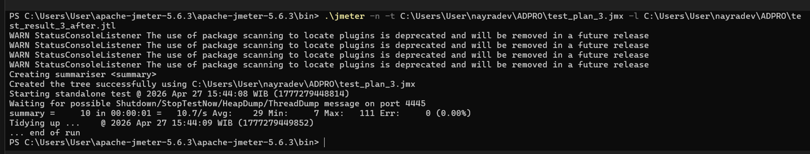
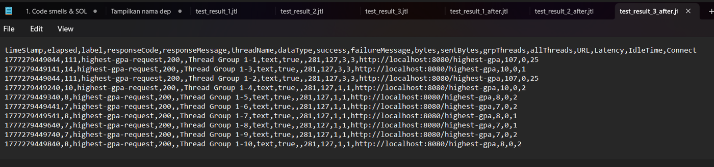

Endpoint :  /all-student
Average Sample Time : 724 ms
Improvement : ~98.8%

Endpoint : /all-student-name
Average Sample Time : 214 ms
Improvement : ~90.5%

Endpoint : /highest-gpa
Average Sample Time : 29 ms
Improvement : ~78.4%

Conclusion : Yes, there is a significant improvement from JMeter measurements after optimization.
The /all-student endpoint improved by ~98.8% (from 62,768ms to 724ms) by replacing
the N+1 query problem with a single JOIN FETCH query. Then, the /all-student-name endpoint
improved by ~90.5% (from 2,244ms to 214ms) by replacing inefficient string
concatenation with StringBuilder. Lastly, the /highest-gpa endpoint improved by ~78.4%
(from 134ms to 29ms) by replacing a full table scan with an optimized database query.

# Reflection
### 1. Difference between JMeter and IntelliJ Profiler
JMeter tests performance from the outside by simulating multiple users hitting
endpoints and measuring response time. Meanwhile, IntelliJ Profiler works from the inside
by showing which specific methods that consume the most CPU time and memory.
JMeter tells user there is a problem, while IntelliJ Profiler tells user
exactly where the problem is.

### 2. How profiling helps identify weak points
Profiling provides a detailed view of method execution times via Flame Graph
and Method List. From the exercise, profilling helped me to identify that getAllStudentsWithCourses had an N+1
query problem, joinStudentNames used inefficient string concatenation, and
findStudentWithHighestGpa fetched all data unnecessarily instead of querying
directly for the highest GPA student.

### 3. Is IntelliJ Profiler effective?
Yes, IntelliJ Profiler is very effective. The flame graph visually shows which
methods dominate execution time, meanwhile the method list provides precise CPU time
measurements per method. It made us easier to identify all the bottlenecks without needing to manually
inspect every line of code.

### 4. Main challenges
The main challenges were managing port conflicts (port 8080 already in use)
and waiting for large data seeding (20,000 students) to complete. The port
conflict was overcome by identifying the process using `netstat -ano` and
terminating it with `taskkill /PID`. The data seeding challenge was handled
by simply waiting for the seeding process to complete.

### 5. Main benefits of IntelliJ Profiler
- The flame graph gives me an instant visual representation of where the application
  is spending most of its time, it makes me easier to spot the bottlenecks at a glance.
- CPU time is measured in every method, so i know how long each method takes time.
- We don't have to install or configure any additional tools
- I can directly compare the profiling sessions side by side to clearly see the
  impact of the optimizations that i did
- Instead of blindly reviewing code, profiling helped me to directly know
  the methods that actually need attention

### 6. Handling inconsistencies between JMeter and IntelliJ Profiler
If results are inconsistent, I would prioritize investigating further by running
multiple profiling sessions to account for JVM warm-up effects. JMeter measures
end-to-end response time including network latency, while IntelliJ Profiler
measures pure CPU execution time, so some difference is expected and normal.
The key is to look at the trend rather than exact numbers.

### 7. Optimization strategies
Three strategies were implemented:
- Replace N+1 queries with JOIN FETCH (getAllStudentsWithCourses)
- Replace string concatenation with StringBuilder/Stream (joinStudentNames)
- Replace full table scan with optimized query (findStudentWithHighestGpa)

Functionality was ensured by verifying that all endpoints still returned
correct responses after each optimization, and by running JMeter tests again
to confirm the improvements without breaking existing behavior.

